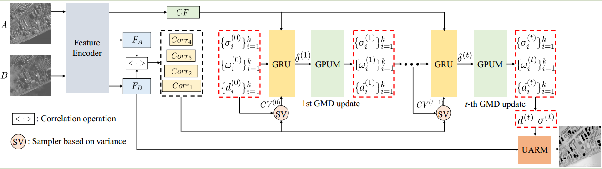
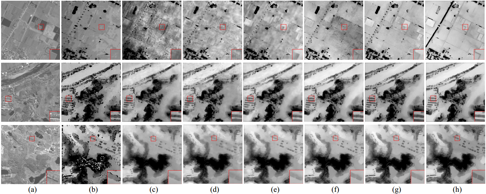
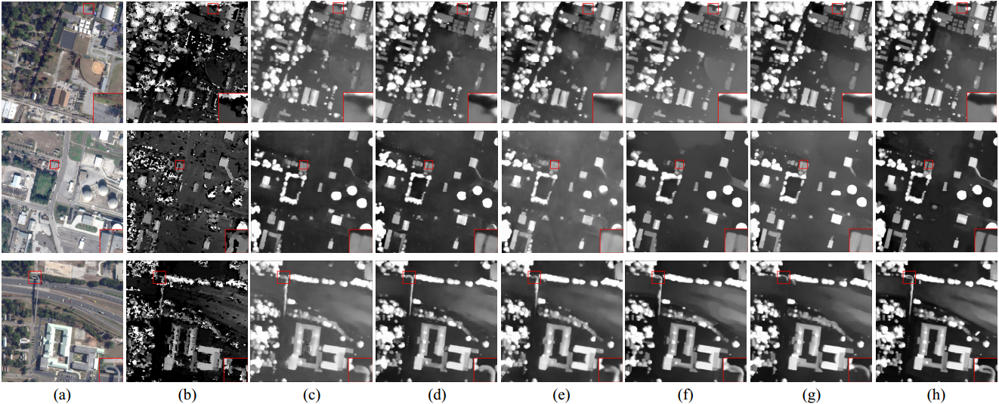

# GMDNet
This is the official code for GMDNet.
## Requirements

```python```
```einops```
```torch```
```numpy```
```tqdm```
```cv```
```pandas```

# Framework



## Visualization

### Visualization on WHU-Stereo dataset


(a) left image. (b) SGM. (c) PSMNet. (d) GwcNet. (e) HMSMNet. (f) S-RAFT. (g) GREAT-Stereo. (h) Ours.

### Visualization on US3D dataset


(a) left image. (b) SGM. (c) PSMNet. (d) GwcNet. (e) HMSMNet. (f) S-RAFT. (g) GREAT-Stereo. (h) Ours.

## Dataset Preparation
* [WHU-Stereo](https://github.com/Sheng029/WHU-Stereo)
* [US3D](https://ieee-dataport.org/open-access/data-fusion-contest-2019-dfc2019)
  
  Note：If you want to use our preprocessed US3D dataset, please download：

## Comparsion on WHU-Stereo dataset
The best score for each metric is marked in **bold**.

|Method       |  EPE(Px)  |  D1(%) |
|-------------|-----------|--------|
|SGM          |  4.989    |  36.22 |
|PSMNet       |  2.183    |  21.95 |
|GwcNet       |  2.265    |  22.80 |
|HMSMNet      |  2.040    |  19.00 |
|S-RAFT       |  1.878    |  17.07 |
|GREAT-Stereo |  1.847    |  16.95 |
|Ours         |**1.726**  |**14.65**|

## Comparsion on US3D dataset
The best score for each metric is marked in **bold**.
|Method       |  EPE(Px)  |  D1(%) |
|-------------|-----------|--------|
|SGM          |  2.398    |  19.93 |
|PSMNet       |  1.499    |  9.22 |
|GwcNet       |  1.406    |  8.09 |
|HMSMNet      |  1.473    |  9.17 |
|S-RAFT       |  1.430    |  8.45 |
|GREAT-Stereo |  1.408    |  8.01 |
|Ours         |**1.393**  |**8.49**|

## Train
Once our paper is accepted, we will release the training code.
